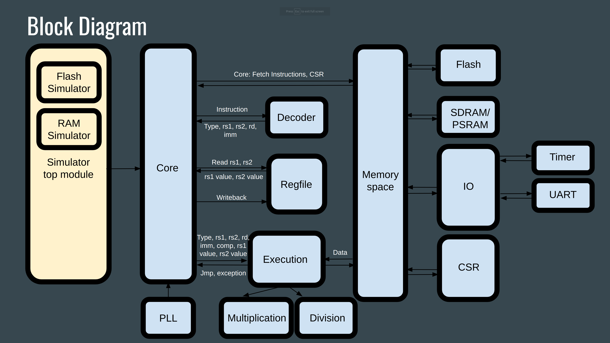

# RISC-V_micro - A 32-bit RISC-V Microcontroller

Blue Whale is a 32-bit RISC-V processor developed in SystemVerilog targeted to Lattice Semiconductor ECP5 FPGA.
It works on the [ULX3S ECP5 85F](https://radiona.org/ulx3s/), a commercially available ECP5 board.
The processor supports the [base 32-bit ISA](https://drive.google.com/file/d/1s0lZxUZaa7eV_O0_WsZzaurFLLww7ou5/view), compressed, multiplication/division, atomic, zicsr, zicond and zifencei extensions. The Machine mode is implemented as described in the [RISC-V Priviledged Architecture document](https://drive.google.com/file/d/1EMip5dZlnypTk7pt4WWUKmtjUKTOkBqh/view).

The Blue Whale project includes a simulator that can execute RISC-V application code using the actual SystemVerilog design.

The project is entirely developed using open source tools:
* iverilog and vvp: a Verilog compiler and a runtime engine.
* gtkwave: view waveforms exported by iverilog.
* yosys: synthesis tool for FPGAs.
* next-pnr: place and route tool for FPGAs.
* ecppack: bitstream packer
* openFPGALoader: FPGA programmer.
* spike: A C++ RISC V simulator.

The RISC-V application binaries are compiled using the GNU toolchain for RISC-V.

## How to get started?
My development was done entirely on Linux (Ubuntu 22.04).

The simplest way to install the tools you will need is to use [apio](https://pypi.org/project/apio/).
Run apio to install oss-cad-suite:
```
> ./apio install oss-cad-suite
```

Ensure that you have version oss-cad-suite 0.1.0 or later.
```
> ./apio install --list
Installed packages:

----------------------------------------------------------
Name        Description                    Version
----------------------------------------------------------
oss-cad-suite YosysHQ/oss-cad-suite          0.1.0
```

### Using scripts to run the simulator and/or program the FPGA
Three scripts are available to simplify the use of the simulator as well as building and flashing the FPGA.

'tests.sh' runs a test for each one of the supported RISC-V instructions.

'sim.sh' is used to simulate a Verilog design. It supports two designs at this time: the memory space test and the pipelined RISC-V processor.

'fpga.sh' synthesizes a design, place and routes for the target FPGA, packs a bitstream and programs the FPGA for the aforementioned designs.

The source code for the TestC, Console and Dhrystone RISC-V C code applications is also available in this repository. Here is a brief description of each application:
* TestC is a simple application that runs from RAM or flash and handles timer interrupts.
* Console is a UART console that allows you to communicate over USB with the serial port implemented in the processor. You can use any serial communication program configured for 3,000,000 baudrate in 8N1 mode for this purpose.
* Dhrystone is a performance evaluation application that enables you to view printf output of this application with a serial communication program.

### Simulation
Before running the instructions test script you need to build the test binaries (over 90 .bin files).

Build the [RISC V architecture test](https://github.com/riscv-non-isa/riscv-arch-test) binaries:

```
> cd apps/TestCompliance/Release
> ./build.sh
```

Run all the instruction tests in the pipelined processor:
```
> cd hdl
> ./tests.sh
```

To test the memory space (RAM, flash, IO, CSR and interrupts):
```
> ./sim.sh -m
```

To run the processor either in the simulator or on the FPGA you need to build the RISC-V sample apps first.
Ensure that the [GNU toolchain for RISC-V xPack](https://github.com/xpack-dev-tools/riscv-none-elf-gcc-xpack/releases) is installed.
Add the /bin folder of the xPack to your path and then build each one of the Console, TestC and the Dhrystone applications:

```
> cd apps/<name_of_the_app>/Release
> make -f makefile_ulx3s all
```

Run the TestC.bin application on the RISC-V processor:
```
> ./sim.sh -p -D D_IO -D BIN_FILE_NAME=\"../apps/TestC/Release/TestC.bin\"
```

Run the Dhrystone.bin application on the RISC-V processor:
```
> ./sim.sh -p -D D_IO -D BIN_FILE_NAME=\"../apps/Dhrystone/Release/Dhrystone.bin\"
```

Run the TestC.bin application on the RISC-V processor and view executing instructions:
```
> ./sim.sh -p -D D_IO -D D_EXEC -D BIN_FILE_NAME=\"../apps/TestC/Release/TestC.bin\"
```

Write the output to a file to view it:
```
> ./sim.sh -p -D D_IO -D D_EXEC -D BIN_FILE_NAME=\"../apps/TestC/Release/TestC.bin\" > out.txt
```

Run the TestC.bin application on the processor, view executing instructions and view pipeline operations:
```
> ./sim.sh -p -D D_CORE -D D_CORE_FINE -D D_IO -D D_EXEC -D BIN_FILE_NAME=\"../apps/TestC/Release/TestC.bin\"
```

### Running on the FPGA
Before you can program the FPGA with the help of the fpga.sh script you need to set the TRELLISD_DB in the script to the correct path to the Trellis database which is included in the oss-cad-suite package.
```
TRELLISD_DB="/home/virgild/.apio/packages/tools-oss-cad-suite/share/trellis/database"
```

Run the memory space test:
```
> ./fpga.sh -m -D CLK_PERIOD_NS=16
```
> [!Note]
> The test runs continuously. When the test works the first 7 out of 8 LEDs will light up and the last LED will remain off. If a failure is detected the last LED will blink.

TestC application running on the RISC-V processor:
```
> ./fpga.sh -p -D CLK_PERIOD_NS=16 -b ../apps/TestC/Release/TestC.bin
```

Dhrystone application running in the RISC-V processor:
```
> ./fpga.sh -p -D CLK_PERIOD_NS=20 -b ../apps/Dhrystone/Release/Dhrystone.bin
```

To view the printf output for any of the above applications use a serial communication application on the host machine.
After the serial application is running press the reset button on the board to view the output of printf. For example the Dhrsytone application will output:
```
Microseconds for one run through Dhrystone: 145
Dhrystones per Second:                      6876
mcycle = 72951
minstret = 4414
```

## Performance
Running Dhrystone in the simulator yields the following output.

```
> ./sim.sh -p -D D_IO -D BIN_FILE_NAME=\"../apps/Dhrystone/Release/Dhrystone.bin\"
Running on ULX3S.
Running pipeline version.
                   0 INITIAL: Loading .bin file: ../apps/Dhrystone/Release/Dhrystone.bin...
                   0 INITIAL: Loaded 00002580 bytes to flash.
                   0 INITIAL: CLK_PERIOD_NS: 20 ns.
                   0 INITIAL: ------------------------- Simulation begin ---------------------------
                  10 CORE: Reset start.
                 810 CORE: Reset complete.
              200010 CORE: Starting execution @[00600000]...
Microseconds for one run through Dhrystone: 145
Dhrystones per Second:                      6876
mcycle = 72951
minstret = 4414
             7149610 CORE: ------------- Halt: looping instruction @[8000118c]. -------------
             7149610 CORE: Cycles:                 357439
             7149610 CORE: Instructions retired:   33589
             7149610 CORE: Instructions from ROM:  28
             7149610 CORE: Instructions from RAM:  6099
             7149610 CORE: I-Cache hits:           39416
             7149610 CORE: Load from ROM:          2434
             7149610 CORE: Load from RAM:          1339
             7149610 CORE: Store to RAM:           6510
             7149610 CORE: IO load:                0
             7149610 CORE: IO store:               128
             7149610 CORE: CSR load:               9
             7149610 CORE: CSR store:              2
             7149610 CORE: Timer interrupts:       0
             7149610 CORE: External interrupts:    0
```
The numbers above yield a DMIPS of 6876 / 1757 = 3.91

DMIPS/MHz = 3.91 / 50 = 0.078

CPI = 72951 / 4414 = 16.52

The Dhrystone application on the FPGA and the simulator yield the same performace numbers.

## FPGA implementation
With all the options enabled (see OPTIONS in fpga.sh) the maximum frequency is 63MHz and the number of cells is 25,121.

Removing the High Performance Counters (remove -D ENABLE_HPM_COUNTERS) yields a maximum frequency to 67MHz and the number of cells is down to 21,531.

Further removing the multiplication/division (ENABLE_RV32M_EXT) yields a maximum frequency to 71MHz and the number of cells drops to 18,699.

Please note that the above numbers are just aproximate numbers. The results vary with each change made to the code.

## Example usages
The code makes use of flags to turn on/off debug output in the simulator. Here are a few examples:
* D_IO: enables output from the IO module (and therefore printf).
* D_EXEC: enables output from the execution module with all details about each executing instruction.
* D_CORE: Core debug output
* D_CORE_FINE: Core detailed debug output.
See a complete list in sim.sh.

Here is a snippet of output when running an application with D_CORE and D_IO to view the application printf output.

```
> ./sim.sh -p -D D_CORE -D D_IO -D BIN_FILE_NAME=\"../apps/TestC/Release/TestC.bin\"
Running on ULX3S.
Running pipeline version.
                   0 INITIAL: Loading .bin file: ../apps/TestC/Release/TestC.bin...
                   0 INITIAL: Loaded 0000166c bytes to flash.
                   0 INITIAL: CLK_PERIOD_NS: 20 ns.
                   0 INITIAL: ------------------------- Simulation begin ---------------------------
                  10 CORE: Reset start.
                 810 CORE: Reset complete.
              200010 CORE: Starting execution @[00600000]...
             2549530 CSR: New interrupts: 00000080. Enabled: 00000880. Pending now: 00000080.
             2550250 CSR: [8000041c]: === INTERRUPT_TIMER @[80000030] ===
             2602270 CSR: [8000041c]: === Exit interrupt. ===
             ...
Hello RISC-V on FPGA!
             3805830 CSR: New interrupts: 00000080. Enabled: 00000880. Pending now: 00000080.
             3806690 CSR: [8000115a]: === INTERRUPT_TIMER @[80000030] ===
             3858770 CSR: [8000115a]: === Exit interrupt. ===
             3898870 CORE: ------------- Halt: looping instruction @[800014f8]. -------------
             3898870 CORE: Cycles:                 194902
             3898870 CORE: Instructions retired:   14967
             3898870 CORE: Instructions from ROM:  28
             3898870 CORE: Instructions from RAM:  2619
             3898870 CORE: I-Cache hits:           16906
             3898870 CORE: Load from ROM:          1410
             3898870 CORE: Load from RAM:          724
             3898870 CORE: Store to RAM:           2603
             3898870 CORE: IO load:                24
             3898870 CORE: IO store:               47
             3898870 CORE: CSR load:               48
             3898870 CORE: CSR store:              36
             3898870 CORE: Timer interrupts:       11
             3898870 CORE: External interrupts:    0
```

The output snippet below is from an application running with D_EXEC flag to view each instruction executed by the processor.
```
> ./sim.sh -p -D D_CORE -D D_IO -D D_EXEC -D BIN_FILE_NAME=\"../apps/TestC/Release/TestC.bin\"
Running on ULX3S.
Running pipeline version.
                   0 INITIAL: Loading .bin file: ../apps/TestC/Release/TestC.bin...
                   0 INITIAL: Loaded 0000166c bytes to flash.
                   0 INITIAL: CLK_PERIOD_NS: 20 ns.
                   0 INITIAL: ------------------------- Simulation begin ---------------------------
                  10 CORE: Reset start.
                 810 CORE: Reset complete.
              200010 CORE: Starting execution @[00600000]...
              200770 [00600000]: 82000137 lui rdx2[82000000], 82000000; PC: [00600004]
              201550 [00600004]: ff810113 addi rdx2[81fffff8], rs1x2[82000000] fffffff8; PC: [00600008]
              202210 [00600008]: 800002b7 lui rdx5[80000000], 80000000; PC: [0060000c]
              202990 [0060000c]: 00028293 addi rdx5[80000000], rs1x5[80000000] 00000000; PC: [00600010]
              203650 [00600010]: 80001e37 lui rdx28[80001000], 80001000; PC: [00600014]
              204430 [00600014]: 608e0e13 addi rdx28[80001608], rs1x28[80001000] 00000608; PC: [00600018]
              205150 [00600018]: 405e0333 sub rdx6[00001608], rs1x28[80001608] rs2x5[80000000]; PC: [0060001c]
              205870 [0060001c]: 00235f13 srli rdx30[00000582], rs1x6[00001608] 00000002; PC: [00600020]
              206530 [00600020]: 006003b7 lui rdx7[00600000], 00600000; PC: [00600024]
              207310 [00600024]: 06438393 addi rdx7[00600064], rs1x7[00600000] 00000064; PC: [00600028]
              208030 [00600028]: 000f0a63 beq rs1x30[00000582], rs2x0[00000000] 00000014; PC: [0060002c]
              208750 [0060002c]: 0003ae83 lw rdx29, rs1x7[00600064] 00000000; load @[00600064]...
              210030           :          @[00600064] -> rdx29[00002197]; PC: [00600030]
              210090 [00600030]:     0391 c.addi rdx7[00600068], rs1x7[00600064] 00000004; PC: [00600032]
              210910 [00600032]: 01d2a023 sw rs1x5[80000000], rs2x29[00002197] 00000000; store @[80000000]
              211050           :          rs2x29[00002197] -> @[80000000]; PC: [00600036]
              211630 [00600036]:     0291 c.addi rdx5[80000004], rs1x5[80000000] 00000004; PC: [00600038]
              212350 [00600038]:     1f7d c.addi rdx30[00000581], rs1x30[00000582] ffffffff; PC: [0060003a]
              213010 [0060003a]:     b7fd c.jal rdx0[00000000], ffffffee; PC: [00600028]
              213850 [00600028]: 000f0a63 beq rs1x30[00000581], rs2x0[00000000] 00000014; PC: [0060002c]
              213910 [0060002c]: 0003ae83 lw rdx29, rs1x7[00600068] 00000000; load @[00600068]...
              214550           :          @[00600068] -> rdx29[e0018193]; PC: [00600030]
              ...
```
## Block Diagram
The diagram below will help you understand the architecture of the processor and help you navigate the source code a bit easier.



Please see more detail on the project [wiki pages](https://github.com/gildobjanschi/RISC-V_micro/wiki).

## More work needed
I appreciate feedback for bug fixes and improvements. There are a few area where I would like to see performace improvements:
* Improve the performance of the multiplier and divider.
* Increase the maximum frequency for the overall design with optimizations.

## Blue Whale Hardware
If you look at the project sources you will notice that in the Verilog source code, in the script files as well as the application makefiles there is mention of the [Blue Whale hardware](https://github.com/gildobjanschi/blue_whale_hw). This hardware is a small board based on ECP5 that features 8MB PSRAM. I mentioned this here so you can make sense of the various flags and makefiles that reference the Blue Whale hardware.
